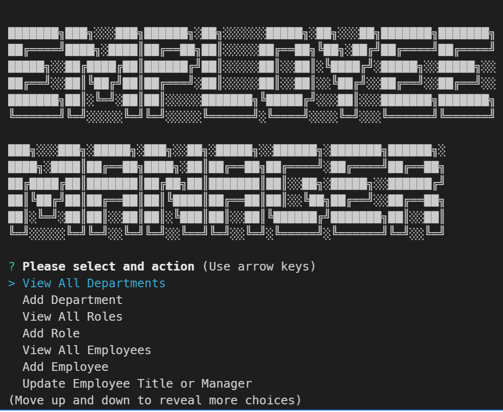
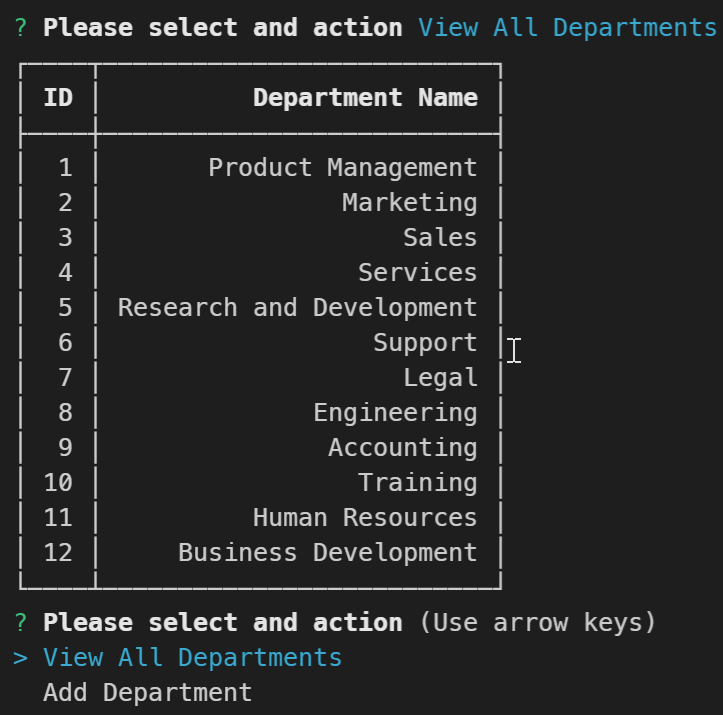

# Employee Managment CLI

A CLI tool for Interfacing with a local Employee database.

[Video Demo](https://youtu.be/5_asQPjHZGw)

## Documentation

[Installation](#installation)

[Local Setup](#local-setup)

[Methods](#Methods)

[Examples](#examples)

[Credits](#credits)

## Installation

Clone the repo

```Shell
git clone https://github.com/minusInfinite/simple-notes.git
cd /simple-notes
```

This application uses the package manager Yarn - https://yarnpkg.com/
You may need to insure Yarn Classic is installed globally beforehand

```Shell
npm install -g yarn
yarn install
```

If there are any issues, you may need to just run `yarn install` again to setup the Plug and Play system correctly.

You will also need to have a MySQL server to connect to.

## Local Setup

To setup your local environment add a `.env` file with the following variables

```env
DBNAME=
DBUSER=
DBPASS=
DBHOST=
```

The database schema and demostration seed database is availalbe in the `/db` folder

```mysql
mysqlsh.exe --sql -u <username>

mysql> \. schema.sql
mysql> \. seed.sql

```

Once the database is setup you will be able to run the application with `yarn start`

## Methods

From the CLI you will see the following options

```Shell
View All Departments - View a table of all departments
Add Department - Add a new Department
View All Roles - View a table of all Title, Salary and the Department
Add Role - Add a new Role, inputing the Title, Salary and Department
View All Employees - View Employees with their Title, Salary, Department and Manager
Add Employee - Add a new Employee, inputing their Name, title and manager. There is an option of "None" to allow them to be a manager
Update Employee Title or Manager - You will be given an option
Quit - Close the application
```

## Examples

[Video Demo](https://youtu.be/5_asQPjHZGw)





## Credits

This application has the following depenancies

- Chalk - <https://github.com/chalk/chalk>
- Console-Table-Printer - <https://console-table.netlify.app/>
- DotENV - <https://github.com/motdotla/dotenv>
- inquirer - <https://github.com/SBoudrias/Inquirer.js>
- mysql2 - <https://github.com/sidorares/node-mysql2>

Running on NodeJS - <https://nodejs.org/>

ASCII Text Logo generated at <https://fsymbols.com/generators/carty/>
